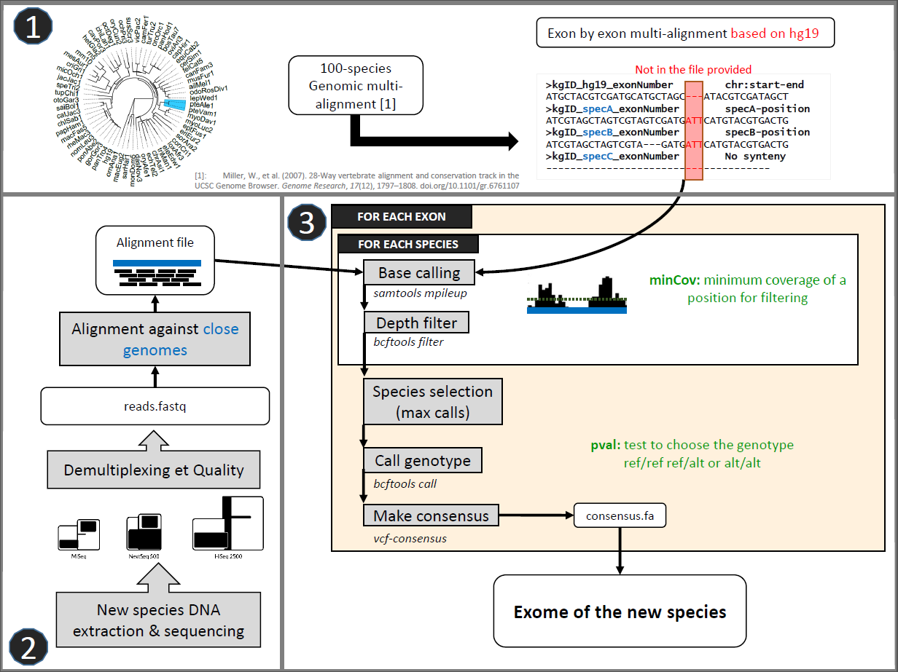

# Installation

Please be carefull to dependencies specified hereafter.

* Parameters - configuration

```
./configure -h
```

* Create executables 

```
make
```

* Install 

```
sudo make install  
#OR to erase previewsly installed
sudo make force_install
```

* Uninstall

```
sudo make uninstall
```

* Delete executables

```
make clean
```

# List of main softwares

* `gwAlign-Extend`



* `gwAlign-Unify`

# Usage

For help run executable with -h or --help

# Dependencies

* Python 2.7 (or higher but never tested)
	* upype
	* Bio
	* pysam
	* numpy

* HPC with PBS or SLURM with qsub interface
* samtools (from version 1.3)
* Platypus
* PicardTools
* MACSE

# LICENCE

All files in this repository are authored by Julien FOURET and licenced under the GNU Public Licence v3.0

This work have been done during a PhD fellowship co-funded by [ViroScan3D](http://www.viroscan3d.com/) and the DGA (Direction Générale de l'Armement) in the context of a [CIFRE-Défense](https://www.ixarm.com/fr/theses-dga-cifre-defense)

```
/*
 *   gwAlign is a program composed of 2 distinct modules:
 *   
 *   The module Unify from gwAlign builds databases of 
 *   multiple coding sequences alignments (MCSA). 
 *   
 *   The module Extend from gwAlign give the possibility 
 *   to extend the number of species available using 
 *   medium coverage (30-50x) of pair-end reads by 
 *   mapping/local re-assembly. 
 *   
 *   Copyright (C) 2018  Julien Fouret
 *
 *   This program is free software: you can redistribute it and/or modify
 *   it under the terms of the GNU General Public License as published by
 *   the Free Software Foundation, either version 3 of the License, or
 *   (at your option) any later version.
 *
 *   This program is distributed in the hope that it will be useful,
 *   but WITHOUT ANY WARRANTY; without even the implied warranty of
 *   MERCHANTABILITY or FITNESS FOR A PARTICULAR PURPOSE.  See the
 *   GNU General Public License for more details.
 *
 *   You should have received a copy of the GNU General Public License
 *   along with this program.  If not, see <https://www.gnu.org/licenses/>.
 */
```
